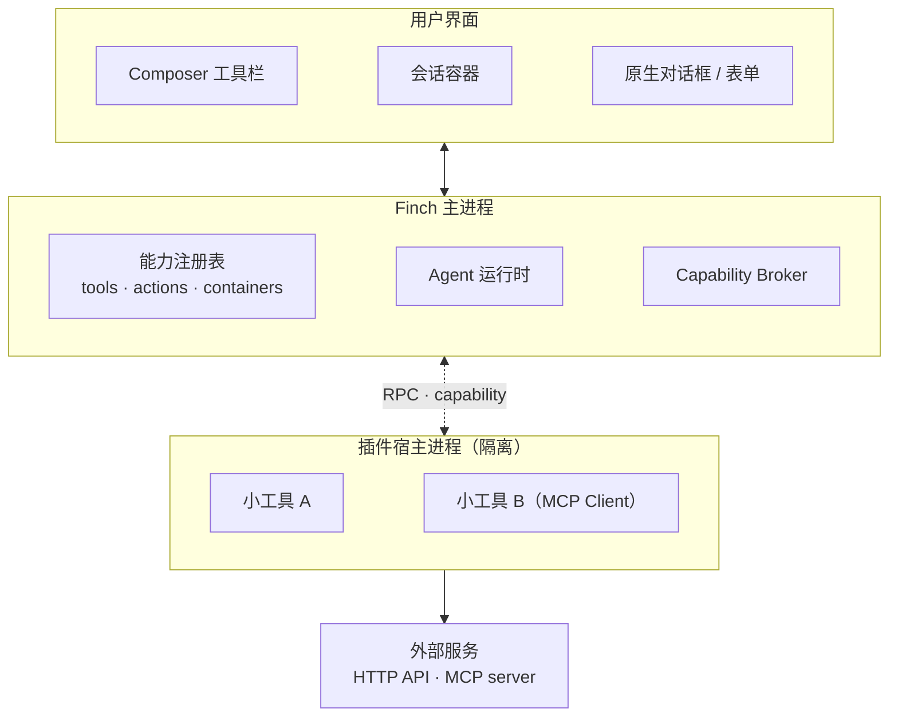
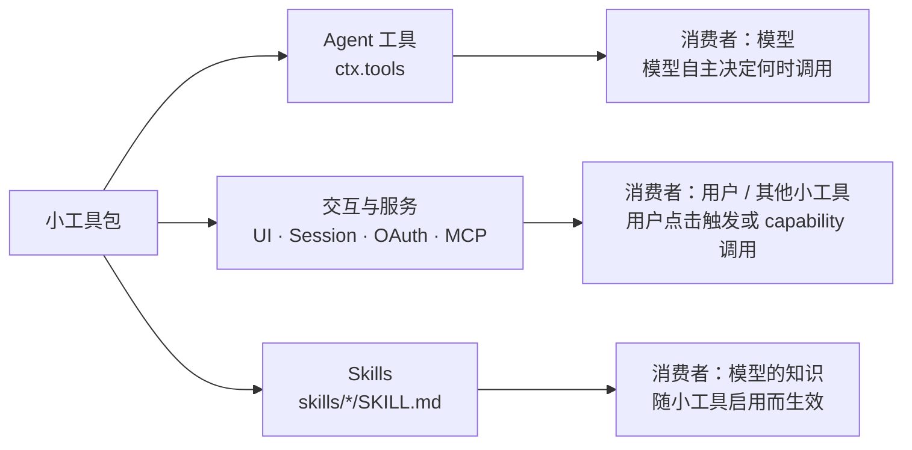
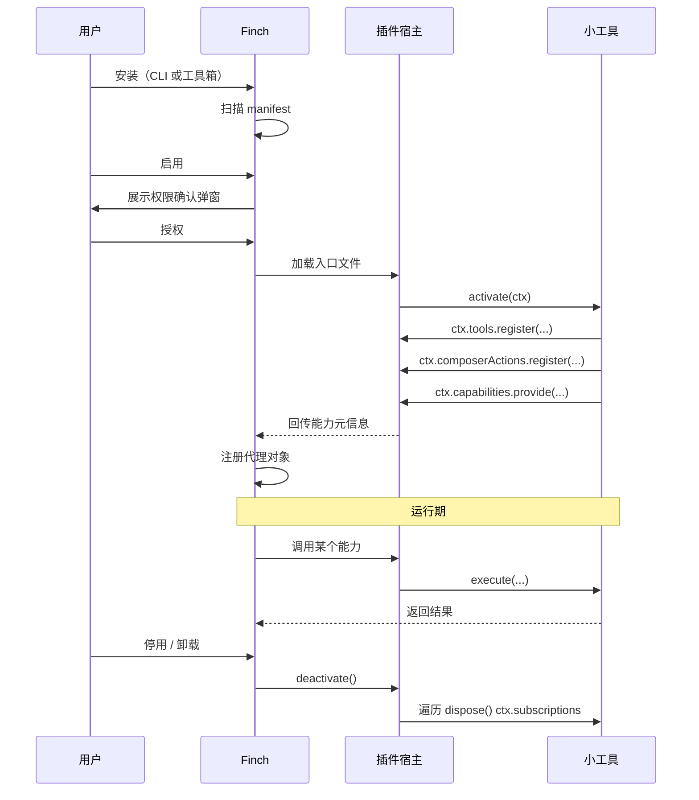
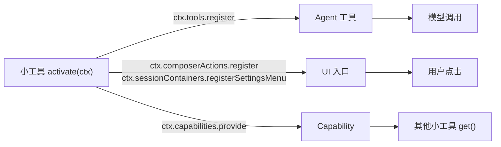
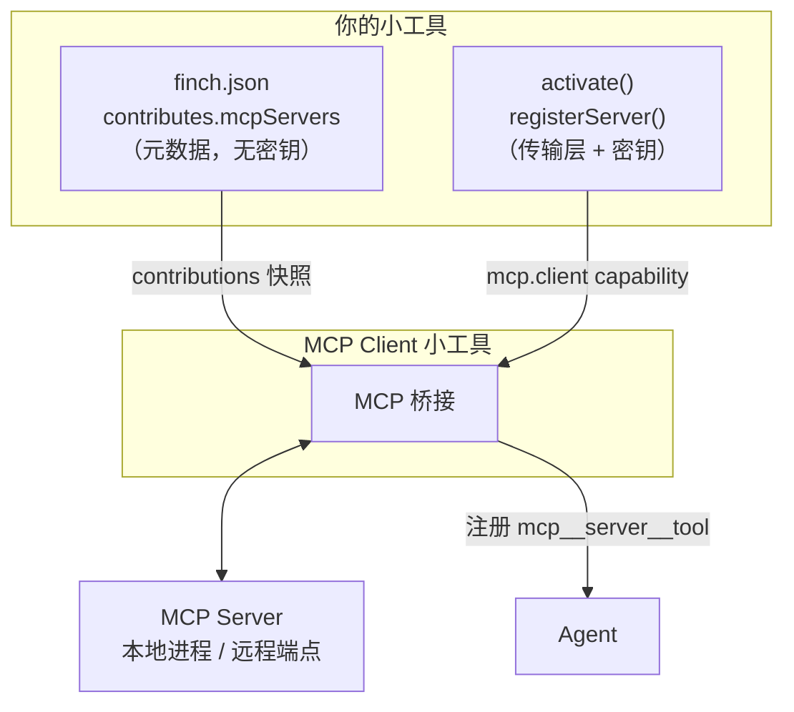
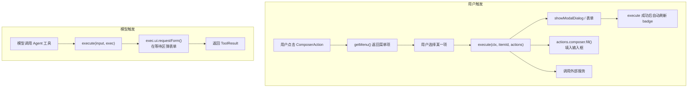
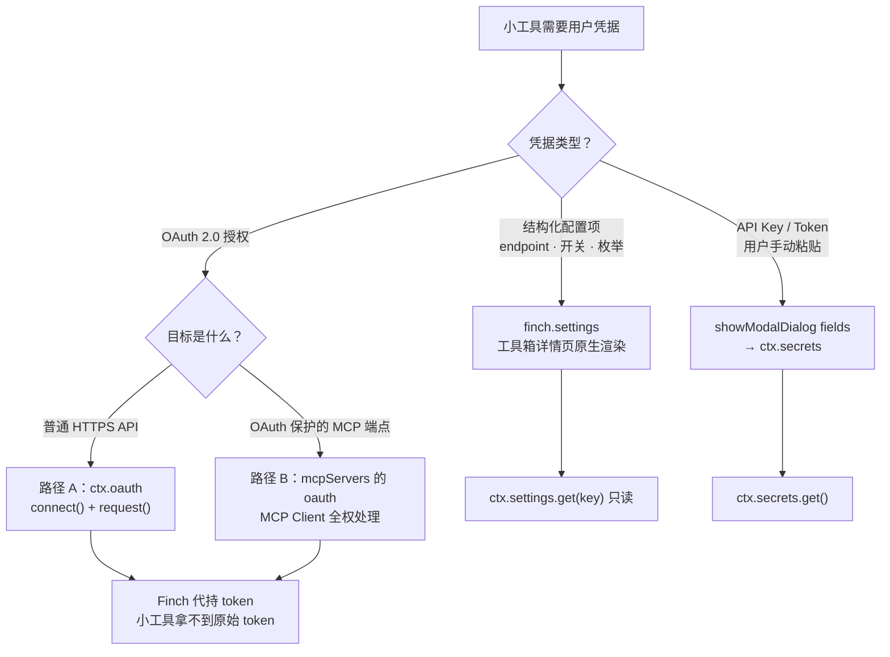
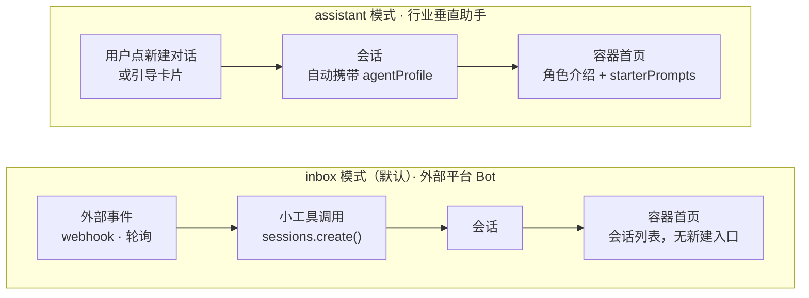
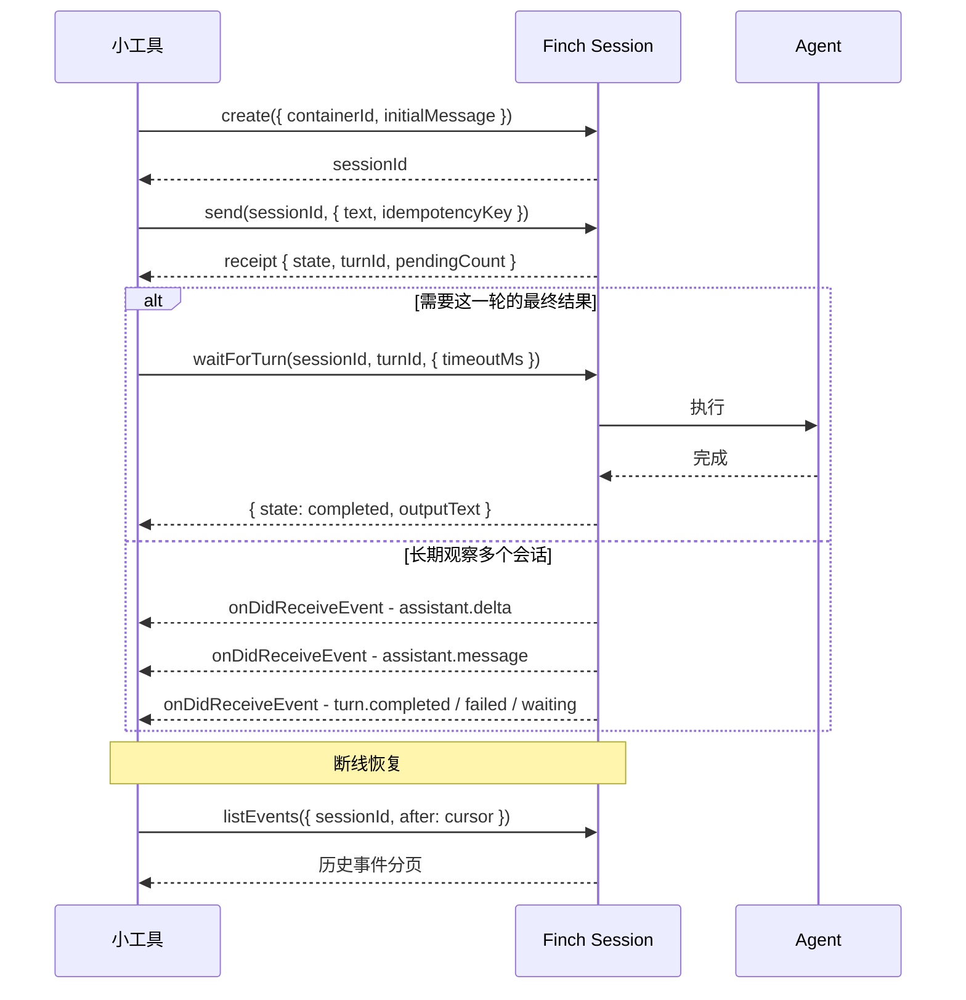
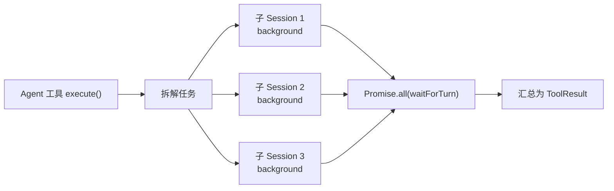

# Finch 小工具开发指南

> 面向小工具开发者。

---

## 目录

1. [小工具是什么](#1-小工具是什么)
2. [快速开始](#2-快速开始)
3. [小工具的组成](#3-小工具的组成)
4. [生命周期与能力注册](#4-生命周期与能力注册)
5. [MCP 集成](#5-mcp-集成)
6. [标准化 UI](#6-标准化-ui)
7. [账号、配置与 OAuth 登录](#7-账号配置与-oauth-登录)
8. [Session 容器](#8-session-容器)
9. [Session Loop](#9-session-loop)
10. [调试、安装与发布](#10-调试安装与发布)

附录 A：`ctx` 能力速查表 · 附录 B：manifest 字段速查表

---

## 1. 小工具是什么

**小工具 = 给 Finch 加装备的小程序。**

它是一个 npm 风格的 TypeScript 包，由 Finch 从文件系统发现并加载，运行在独立于主进程的插件宿主进程中。小工具可以向 Finch 贡献 Agent 工具、Composer 工具栏按钮、独立的会话容器、Skills 以及 MCP server。

### 1.1 能力边界

| 小工具**可以** | 小工具**不可以** |
|---|---|
| 注册 Agent 工具，让模型调用外部服务 | 直接调用 Electron API 或 Finch 内部模块 |
| 在 Composer 工具栏加按钮和菜单 | 渲染自定义 HTML 页面（Canvas 窗口除外） |
| 弹出 Finch 原生对话框、表单收集输入 | 读写用户的普通对话 Session |
| 创建并管理自己的 Session 容器和会话 | 访问其他小工具的 Session、密钥、存储 |
| 通过 OAuth 登录第三方服务并发起授权请求 | 拿到 OAuth 的原始 access token |
| 向其他小工具提供 / 消费 capability | 绕过 manifest 声明使用未授权能力 |

### 1.2 典型场景

| 场景 | 做法 | 关键能力 |
|---|---|---|
| **接第三方服务** — 博客发文、任务系统、云盘 | 一个带 `action` 参数的 Agent 工具 + OAuth 登录 | `ctx.tools`、`ctx.oauth` |
| **外部平台 Bot** — 微信、飞书、Telegram 消息接入 | `inbox` 容器 + 每个联系人一个 Session | `ctx.sessions`、容器 |
| **行业垂直助手** — 法务助手、旅行管家、代码评审官 | `assistant` 容器 + `agentProfile` 人设 | 容器、`agentProfiles` |
| **Composer 快捷操作** — 切分支、切模式、选模板 | ComposerAction 按钮 + 动态菜单 | `ctx.composerActions` |
| **多 Agent 编排** — 拆解任务、并行执行、汇总结果 | 主工具创建多个子 Session 并等待结果 | Session Loop |
| **接入 MCP 生态** — 复用已有 MCP server | 声明 `mcpServers` + 运行时注册传输层 | `mcp.client` capability |
| **桌面小部件** — 桌宠、悬浮计时器 | Canvas 悬浮窗口 | `ctx.ui.createCanvasWindow` |
| **打包知识与流程** — 让 Agent 掌握某套专业方法 | 随包携带 Skills | `contributes.skills` |

### 1.3 小工具 vs Skill

| | 小工具 | Skill |
|---|---|---|
| 本质 | 可执行代码 | Markdown 指令文档 |
| 解决 | Agent **做不到**的事（调 API、开窗口、建会话） | Agent **不知道怎么做**的事（流程、规范、方法论） |
| 交付 | npm 包，需安装启用 | 一个 `SKILL.md` 目录 |
| 何时选 | 需要网络、文件、UI、账号、会话 | 只需给模型一套稳定的做事方法 |

小工具可以在包内携带 Skills，两者组合使用。

### 1.4 整体架构



三个要点：

- 小工具跑在独立进程，崩溃或阻塞不会拖垮 Finch 主进程。
- 所有能力通过唯一入口 `ctx` 暴露，不存在其他调用通道。
- 小工具之间不互相 import，只通过 capability 协作。

---

## 2. 快速开始

> 强烈推荐使用 finch-mini-tool-creator skill 来创建小工具。 你只需要用自然语言描述你的需求，Finch 会帮你完成小工具的开发。如果你想了解更多小工具细节，可以继续往下阅读。

### 2.1 最小结构

```text
my-mini-tool/
├── finch.json          # manifest（推荐；也可用 package.json#finch）
├── package.json
├── tsconfig.json
└── src/
    └── index.ts        # 编译到 dist/index.js
```

### 2.2 manifest

```json
{
  "manifestVersion": 1,
  "id": "my-mini-tool",
  "name": "My Mini Tool",
  "main": "dist/index.js",
  "activationEvents": ["onStartup"],
  "contributes": {
    "tools": true,
    "composerActions": [
      { "id": "my-btn", "icon": "Star", "tooltip": "快捷操作" }
    ]
  },
  "permissions": {
    "network": true
  }
}
```

### 2.3 入口代码

```ts
import type * as finch from '@finchtoys/minitool-api';

export function activate(ctx: finch.MiniToolContext): void {
  // 1) 注册一个 Agent 工具
  ctx.subscriptions.push(
    ctx.tools.register({
      name: 'my_mini_tool_search',
      title: 'Search',
      description: 'Search items by keyword.',
      inputSchema: {
        type: 'object',
        properties: { query: { type: 'string' } },
        required: ['query'],
      },
      async execute({ query }, exec) {
        exec.progress.report({ message: 'Searching…' });
        const text = await doSearch(String(query));
        return { content: [{ type: 'text', text }] };
      },
    }),
  );

  // 2) 注册一个 Composer 按钮
  ctx.subscriptions.push(
    ctx.composerActions.register('my-btn', {
      async getBadge() { return 'ready'; },
      async getMenu() {
        return [{ id: 'insert', label: '插入模板', iconName: 'file-text' }];
      },
      async execute(_c, itemId, actions) {
        if (itemId === 'insert') await actions.composer.fill('模板内容');
      },
    }),
  );
}

export function deactivate(): void {}
```

### 2.4 三条硬性规则

1. **`activate` 必须是命名导出**，不是 `export default`。
2. **类型引用必须是 `import type`**，`@finchtoys/minitool-api` 只有类型，没有运行时。
3. **所有 `Disposable` 推入 `ctx.subscriptions`**，停用时自动清理。

### 2.5 装上去

```bash
npm run build
npx @finchtoys/minitools doctor .   # 静态检查
npx @finchtoys/minitools add .      # 安装到个人层级
```

然后在 Finch 工具箱里启用。**改完代码需重启 Finch 才生效。**

---

## 3. 小工具的组成

一个包里可以装三类东西，面向三种消费者：



### 3.1 Agent 工具

模型可调用的函数。设计上有两条硬规则。

**规则一：工具数量尽可能少。** 每个注册的工具都会注入模型的每一轮上下文，工具越多越费 token，模型选错的概率也越高。

**规则二：相关操作合并为一个带 `action` 参数的工具。**

```ts
ctx.tools.register({
  name: 'pjblog_post',
  title: 'PJBlog Post',
  description: `Manage blog posts.
action:
  list    — list all posts
  create  — create a new draft
  update  — update an existing post
  publish — publish a draft`,
  inputSchema: {
    type: 'object',
    properties: {
      action: { type: 'string', enum: ['list', 'create', 'update', 'publish'] },
      slug: { type: 'string' },
      title: { type: 'string' },
    },
    required: ['action'],
  },
  risk: 'medium',
  async execute(input, exec) { /* switch (input.action) */ },
});
```

`description` 里必须逐条列出所有 `action`，这是模型唯一的行为说明书。

工具命名固定小写 snake_case，格式 `<mini_tool_name>_<function_name>`，禁止 `init`、`status` 这类通用短名。

工具确实超过 10 个时，改用本地 MCP server 按需加载（见 §5）。

**长任务进度**：`exec.progress.report({ message })` 显示不确定进度条，加上 `percent` 显示确定进度。进度不是结果，工具最终仍要返回一个 `ToolResult`。

### 3.2 交互与服务能力

不面向模型、由用户或系统触发的部分：Composer 按钮、对话框、表单、Session 容器、OAuth 登录、MCP 桥接、后台轮询。这构成小工具的"服务面"，详见 §6–§9。

### 3.3 内置 Skills

包内可携带 Skills，随启用生效、随停用消失：

```text
my-mini-tool/
└── skills/
    └── my-workflow/
        └── SKILL.md
```

manifest 声明 `contributes.skills: true` 即可。它们不会被复制到全局 skills 目录。

---

## 4. 生命周期与能力注册

### 4.1 完整生命周期



### 4.2 静态声明 vs 动态注册

Finch 的能力注册普遍是两段式：manifest 声明槽位，代码填充行为。

| | manifest 静态声明 | `activate()` 动态注册 |
|---|---|---|
| 决定 | 按钮/容器**是否存在**、图标、tooltip | badge 文字、菜单内容、点击行为 |
| 何时读取 | 安装与启动时 | 用户交互时按需调用 |
| 能否隐藏 | 声明即保留槽位 | `getBadge()` 抛错可隐藏按钮 |

这样设计是因为 Finch 在小工具尚未激活时就要渲染 UI 骨架，静态声明保证界面不闪烁。

**注意：`getMenu()` 返回空数组不会让按钮消失。** 可见性由 manifest 决定。

### 4.3 三种能力出口



### 4.4 Capability：小工具之间的协作

小工具不互相 import，通过命名接口协作。提供方和消费方都必须在 manifest 声明：

```json
{
  "provides": { "capabilities": ["my.feature"] },
  "requires": { "capabilities": ["mcp.client"] }
}
```

```ts
// 提供方
ctx.capabilities.provide('my.feature', {
  async listItems() { return []; },
}, { version: '1.2.0' });

// 消费方
if (ctx.capabilities.has('my.feature')) {
  const feature = ctx.capabilities.get('my.feature');
  const items = await feature.listItems();   // 消费侧一律异步
}
```

三条注意事项：

- **消费侧所有方法都是异步的**，跨进程路由决定的。
- **激活顺序不是依赖契约**。目标 capability 可能晚于你激活，需要短轮询等待（见 §5.2）。
- **接口保持小而稳定**，演进时用 `version` 区分。

---

## 5. MCP 集成

MCP 集成是 capability 机制的典型应用：官方 MCP Client 小工具提供 `mcp.client`，其他小工具消费它。



### 5.1 什么时候选 MCP

- 工具集很大（10+）且多数不常同时使用，希望 Finch 按需加载。
- 目标服务已有官方 MCP SDK，不想重写一遍。

### 5.2 两层设计

**静态层**（`finch.json`）只放元数据，**绝不放密钥**：

```json
{
  "requires": { "capabilities": ["mcp.client"] },
  "contributes": {
    "mcpServers": [
      { "name": "my-server", "description": "My MCP server." }
    ]
  }
}
```

**运行时层**在 `activate()` 里提供真正的传输配置：

```ts
async function registerWhenReady(ctx: finch.MiniToolContext, apiKey: string) {
  // MCP Client 可能晚于本工具激活，短轮询等待
  for (let i = 0; i < 20; i++) {
    if (ctx.capabilities.has('mcp.client')) break;
    await new Promise((r) => setTimeout(r, 250));
  }
  if (!ctx.capabilities.has('mcp.client')) return;

  const mcp = ctx.capabilities.get('mcp.client');
  await mcp.registerServer({
    name: 'my-server',
    command: 'npx',
    args: ['-y', 'my-mcp-server'],
    env: { API_KEY: apiKey },
    ownerExtensionId: ctx.minitool.id,
  });
}
```

运行时注册是内存态的，每次激活都要重新执行。

### 5.3 密钥怎么来

标准做法：提供一个 `setup_*` 工具或设置菜单项，用表单收集密钥 → 存 `ctx.secrets` → 调用 `registerServer()`。见 §7。

---

## 6. 标准化 UI

**原则：优先使用 Finch 原生 UI，不要自建对话框和通知外壳。** 原生组件自动适配主题、深色模式、键盘操作和多端一致性。

### 6.1 选型对照

| 需求 | 用什么 |
|---|---|
| 轻量反馈（已保存、已连接） | `ctx.ui.showToast()` |
| 是/否确认（删除、不可逆操作） | `ctx.ui.showConfirmDialog()` |
| 多个动作选择 / 展示信息 | `ctx.ui.showModalDialog()` |
| 用户主动填表（API Key、连接配置） | `ctx.ui.showModalDialog({ fields })` |
| 工具执行中缺参数，需要补充 | `exec.ui.requestForm()` |
| Composer 常驻入口 | ComposerAction 按钮 |
| 容器级账号/连接设置 | 容器 settings menu（见 §8.4） |
| 悬浮小部件（桌宠、计时器） | `ctx.ui.createCanvasWindow()` |

### 6.2 触发链路



### 6.3 ComposerAction：输入框按钮

manifest 声明槽位：

```json
{
  "contributes": {
    "composerActions": [
      { "id": "git-branch", "icon": "GitBranch", "tooltip": "切换分支" }
    ]
  }
}
```

代码提供行为：

```ts
const action = ctx.composerActions.register('git-branch', {
  async getBadge({ cwd }) {
    if (!cwd) throw new Error('N/A');   // 抛错 = 隐藏按钮
    return await getCurrentBranch(cwd); // 字符串 = badge 文字
  },
  async getMenu({ cwd }) {
    return (await listBranches(cwd)).map((b) => ({
      id: b, label: b, iconName: 'git-branch', hoverText: `切换到 ${b}`,
    }));
  },
  async execute({ cwd }, itemId, actions) {
    await checkout(cwd, itemId);
  },
});
ctx.subscriptions.push(action);
```

`getBadge()` 的四种返回：

| 返回 | 效果 |
|---|---|
| `string` | 显示 badge 文字 |
| `{ text?, active? }` | `active: true` 进入高亮"开启"态（强调色图标 + 背景） |
| `undefined` | 只显示图标 |
| 抛出错误 | **隐藏整个按钮**（表示不适用于当前 cwd） |

badge 是**被拉取**的，不会自己定时刷新。后台状态变化时调用注册句柄的 `notifyUpdate()`：

```ts
const timer = setInterval(async () => {
  if (await stateChanged()) action.notifyUpdate();
}, 5000);
ctx.subscriptions.push({ dispose: () => clearInterval(timer) });
```

轮询间隔建议 ≥ 3 秒。`ctx.sessionId` 在会话界面可用，切换开关状态可以按会话隔离而不是全局。

> 📷 **截图位**：Composer 工具栏上的按钮与 badge，含 active 高亮态

### 6.4 菜单

菜单项由 `getMenu()` 动态返回，每次打开都会重新调用。

```ts
[
  { id: 'status', label: '连接状态', description: '已登录',
    iconName: 'toggle-right', disabled: true },
  { id: 'divider', label: '', separator: true },
  { id: 'logout', label: '退出登录', iconName: 'log-in' },
]
```

四条规则：

- **每个可点击项必须有 `iconName`**，且必须是 Finch 内置图标 id 或已注册的 `ext:` SVG。**用了不存在的图标 id 会静默渲染成纯文本，没有任何警告**——这是最高频的踩坑点，设置任何 `icon` 字段前先核对内置图标列表。
- **状态展示不是动作**。用 `disabled: true` 的行显示状态，登录/退出用独立的可点击行。
- **`separator: true` 是独立的一项**，不是下一行的属性。
- 长说明用 `hoverText`（纯文本，保留换行，不解析 Markdown），不要塞进 `label`。

> 📷 **截图位**：菜单展开态，含状态行、分隔线、动作行

### 6.5 模态框

```ts
const result = await ctx.ui.showModalDialog({
  title: '选择操作',
  message: '当前有 3 条未同步记录。',
  actions: [
    { id: 'cancel', label: '取消' },
    { id: 'sync', label: '立即同步', variant: 'primary' },
  ],
});
if (result.action === 'sync') { /* ... */ }
```

`message` 支持轻量结构化文本：空行、行内代码、强调、弱化/警告行，以及**独立成行的 Markdown 图片** ``——用于登录二维码这类临时可视内容。图片源只允许无凭证的 `https://` 或 5MB 以内的 base64 data URL，且只停留在 UI 层，不会进入工具结果或模型上下文。

返回的句柄支持程序化关闭，典型用于扫码登录：

```ts
const dialog = ctx.ui.showModalDialog({
  title: '扫码登录',
  message: `打开 App 扫描下方二维码。\n\n`,
  actions: [{ id: 'close', label: '关闭' }],
});

// 后台轮询到登录成功，主动关掉弹窗
await dialog.close('connected');
const result = await dialog;   // { action: 'connected' }
```

> 📷 **截图位**：带二维码的模态框

### 6.6 表单

**两个 API 渲染完全相同的字段网格**，字段类型都是 `text` / `password` / `textarea` / `number` / `select` / `boolean` / `link`，支持 `required`、`secret`、`width`、`default`、`options`。

选择依据不是"长什么样"，而是**什么时候需要输入**：

| | `exec.ui.requestForm(spec)` | `ctx.ui.showModalDialog({ fields })` |
|---|---|---|
| 调用位置 | 只能在工具的 `execute()` 内 | 任何地方——按钮回调、设置菜单、甚至 `activate()` |
| 依赖模型轮次 | 是，必须模型正在调用你的工具 | 否 |
| 渲染位置 | Composer 等待区卡片 | 原生模态框，带自定义按钮 |
| 适用 | 模型执行到一半缺参数 | 用户主动点设置填 API Key |

```ts
const result = await ctx.ui.showModalDialog({
  title: '配置 API Key',
  actions: [
    { id: 'cancel', label: '取消' },
    { id: 'save', label: '保存', variant: 'primary' },
  ],
  fields: [
    { key: 'apiKey', label: 'API Key', type: 'password', secret: true, required: true },
  ],
});
if (result.action === 'save') {
  await ctx.secrets.set('apiKey', String(result.values?.apiKey ?? ''));
}
```

`fields` 存在时，第一个 `variant: 'primary'` 按钮在必填项填完前保持禁用。`secret: true` 字段的值不回传给模型，必须用 `ctx.secrets` 存储，不要写进工具结果。

> 📷 **截图位**：模态框表单 与 Composer 等待区表单卡片，两者并列

---

## 7. 账号、配置与 OAuth 登录

需要用户凭据的小工具有三条路径，按凭据类型选择。



### 7.1 结构化配置：`finch.settings`

manifest 声明字段，Finch 在工具箱详情页原生渲染，用户保存后自动重载小工具：

```json
{
  "settings": {
    "fields": [
      { "key": "endpoint", "type": "string", "label": "Endpoint" },
      { "key": "maxItems", "type": "number", "label": "最大条数", "default": 10 },
      { "key": "region", "type": "select", "label": "区域",
        "options": [{ "value": "us", "label": "US" }, { "value": "eu", "label": "EU" }] }
    ]
  }
}
```

代码里 `ctx.settings.get('endpoint')` 只读取，不能写入。字段类型：`string`、`number`、`boolean`、`select`、`list`；`string` 可标 `secret: true`（密码框）或 `multiline: true`（多行）。

### 7.2 API Key / Token

用 §6.6 的模态框表单收集，存入 `ctx.secrets`。manifest 需声明允许的密钥名：

```json
{ "permissions": { "secrets": ["apiKey"] } }
```

**入口放哪里**：ComposerAction 菜单、容器设置菜单（§8.4）、或一个 `setup_*` 工具。优先前两者——它们不依赖模型主动调用工具。

### 7.3 OAuth 路径 A：小工具自己持有 provider

用于调用普通 HTTPS API（Google、GitHub 等）。manifest 声明 provider id：

```json
{ "permissions": { "oauth": ["google"] } }
```

代码定义 provider 并发起流程：

```ts
const google: finch.OAuthProviderConfig = {
  id: 'google',
  name: 'Google',
  icon: 'assets/google.png',              // 包内 PNG，显示在授权弹窗
  clientId: PUBLIC_CLIENT_ID,             // 发布者预先注册的公开 Client ID
  authorizationEndpoint: 'https://accounts.google.com/o/oauth2/v2/auth',
  tokenEndpoint: 'https://oauth2.googleapis.com/token',
  scopes: ['https://www.googleapis.com/auth/gmail.readonly'],
  resourceOrigins: ['https://gmail.googleapis.com'],  // HTTPS 白名单
};

await ctx.oauth.connect(google);
const status = await ctx.oauth.getStatus(google);
const res = await ctx.oauth.request(
  google,
  'https://gmail.googleapis.com/gmail/v1/users/me/profile',
);
await ctx.oauth.disconnect(google);
```

Finch 负责浏览器交互、加密存储、刷新加锁、Authorization 头注入。

**安全边界（必须理解）：**

- 只用 Authorization Code + PKCE 公开客户端，**不要内嵌 client secret**。
- Access / refresh token **不会跨进程进入小工具**，只能通过 `ctx.oauth.request()` 代理调用。
- `resourceOrigins` 是 HTTPS 白名单，不在名单内的地址会被拒绝。
- `request()` 会剥离调用方自带的 `Authorization`、`Cookie`、`Host`、`Proxy-Authorization` 头。
- 凭据按小工具隔离存储，互相不可见。
- `OAuthResponse.body` 是字符串，先判断 HTTP 状态再解析；不要记录可能含隐私的响应体。

**Device Flow**：GitHub 这类 Web Flow 需要 secret 的服务，设 `flow: 'device_code'` 并提供 `deviceAuthorizationEndpoint`，Finch 负责展示、复制用户码并轮询令牌端点。

**OAuth 客户端由发布者注册和维护**，公开 Client ID 随包分发，不要让终端用户自己去申请 OAuth 应用。`icon` 强烈建议配置，否则授权弹窗没有品牌标识。

> 📷 **截图位**：Finch 原生 OAuth 授权确认卡片（含 provider 图标）

### 7.4 OAuth 路径 B：OAuth 保护的 MCP server

远程 MCP 端点要求 OAuth 时，**不要走路径 A**。声明 `contributes.mcpServers[].oauth`，由 MCP Client 完成 discovery、动态客户端注册（DCR）、PKCE 和 token 生命周期——你无需注册任何 OAuth 客户端，也不需要 `permissions.oauth`。品牌图标通过 `mcpServers[].oauth.providerIcon` 提供。

**判断法则**：同一个服务同时声明了 `permissions.oauth` 和 `mcpServers[].oauth`，一定是选错了路径。

### 7.5 登录状态怎么呈现

推荐组合：容器设置菜单里放一行 `disabled` 的状态行 + 一行可点击的登录/退出行。后台登录状态变化时调 `notifyUpdate()` 让菜单立即刷新。详见 §8.4。

---

## 8. Session 容器

容器让小工具拥有**自己的会话空间**，而不只是往用户的主对话里塞内容。Bot 接入、垂直助手、多 Agent 编排都建立在容器之上。

### 8.1 前置声明

```json
{
  "contributes": {
    "sessionContainers": [
      { "id": "inbox", "icon": "message-circle", "title": "Bot 收件箱" }
    ]
  },
  "permissions": { "sessions": true }
}
```

`permissions.sessions` 和 `contributes.sessionContainers` 缺一不可，且只能创建自己声明过的容器。容器 `icon` 缺省回退 `bot`。

### 8.2 两种模式



| | `inbox` | `assistant` |
|---|---|---|
| 谁发起会话 | 小工具 | 用户 |
| 首页形态 | 会话列表 | 角色介绍 + `starterPrompts` |
| 模型选择 | 支持容器默认模型 | 隐藏 |
| `agentProfile` | 可选，但通常需要 | **必填** |

`starterPrompts` 是首页引导卡片，最多显示 4 张。点击后 Finch 新建一个容器会话并把卡片的 `prompt` 作为第一条消息发出。

> 📷 **截图位**：inbox 容器首页（会话列表）与 assistant 容器首页（角色介绍 + 引导卡片）

### 8.3 agentProfile：给容器一个人设

profile 绑定在**容器**上，不是单个会话上：

```json
{
  "contributes": {
    "sessionContainers": [
      { "id": "concierge", "title": "旅行管家", "mode": "assistant",
        "agentProfile": "concierge-role" }
    ],
    "agentProfiles": [
      { "id": "concierge-role", "name": "旅行管家",
        "description": "耐心的行程规划专家",
        "prompt": "你是耐心的旅行管家，给出实用、结构化的建议。" }
    ]
  }
}
```

该容器下诞生的每个会话都自动携带这个人设——无论用户点"新建对话"，还是你自己调 `create({ containerId })`。**不要传已废弃的 `create({ profileId })`**，会被忽略。

写 `prompt` 时的关键约束：

- Finch 把 profile 注入为**用户那位 Finch 助手的搭档**，两个身份共存。助手保留自己的名字、性格、记忆和安全规则，profile 只补充专长和分工。
- 所以 `prompt` 应该写**专长 + 工作方式**，不要写"你是一个全新的、与 Finch 无关的 AI"。
- **不要写死助手名字**，用户可以给自己的助手改名。
- profile prompt 是叠加，不能覆盖安全规则或提升权限。
- 投放到 Space 的会话和用户的普通对话**永远不携带 profile**。

### 8.4 容器设置菜单

`inbox` 和 `assistant` 容器都可以在头部区域挂**一个**设置菜单，通常用作账号登录入口。

manifest 声明（决定按钮是否存在）：

```json
{
  "id": "inbox",
  "title": "Bot 收件箱",
  "settingsMenu": { "icon": "settings", "tooltip": "账号与连接设置" }
}
```

运行时注册一次：

```ts
const menu = ctx.sessionContainers.registerSettingsMenu('inbox', {
  async getMenu() {
    return signedIn
      ? [
          { id: 'status', label: '连接状态', description: '已登录',
            iconName: 'toggle-right', disabled: true },
          { id: 'logout', label: '退出登录', iconName: 'log-in' },
        ]
      : [
          { id: 'status', label: '连接状态', description: '未登录',
            iconName: 'toggle-left', disabled: true },
          { id: 'login', label: '登录', iconName: 'log-in' },
        ];
  },
  async execute(_context, itemId) {
    if (itemId === 'login') await startOAuth();   // 可直接开模态框 / OAuth
  },
});
ctx.subscriptions.push(menu);
```

要点：

- 每次打开都会调 `getMenu()`，直接返回最新状态即可。
- `execute()` 成功后菜单自动刷新；**后台**登录成功（OAuth 回调、轮询）需手动调 `menu.notifyUpdate()`。
- 图标回退相互独立：`settingsMenu.icon` 缺省回退 `sliders-horizontal`，容器自身 `icon` 缺省回退 `bot`。
- 空的或失败的 `getMenu()` 不会移除按钮，可见性以 manifest 为准。
- 一个容器只能注册一个设置菜单，且只有拥有它的小工具能注册。

> 📷 **截图位**：容器头部的设置菜单按钮及其展开态

### 8.5 容器默认模型

用户可以在容器行菜单里给容器选一个默认模型，之后 `create({ containerId })` 自动使用它；未选或模型不可用时回退全局默认。**这是用户设置，小工具既不能读也不能改**，且只对 `inbox` 模式生效。投放到 Space 的会话不使用容器模型。

---

## 9. Session Loop

`ctx.sessions` 让小工具创建并驱动自己的会话。典型用途：外部平台 Bot、后台任务处理、多 Agent 编排。

**隔离边界：小工具只能访问自己创建的 Session**，读不到用户的普通对话，也碰不到别的小工具的会话。

### 9.1 完整回路



### 9.2 创建会话

```ts
const session = await ctx.sessions.create({
  containerId: 'inbox',            // 容器投放
  title: 'Chat with Alice',
  activity: 'interactive',         // 或 'background'
  permissionMode: 'ask',           // interactive 默认 ask；background 默认 acceptCalls
  initialMessage: {
    text: 'Hello from the bot.',
    idempotencyKey: 'welcome-alice-2026-01-01',
  },
});
```

**投放位置二选一**，不能混用：

- `containerId` — 投放到自己的容器（小工具默认选择）。
- `space: { spaceId }` — 投放到普通 Space 会话列表，看起来像用户自己建的，所有权仍属小工具。

**activity 的实际差别**：`background` 会话完成或等待时**不弹系统通知**，只在容器入口显示红点提醒，权限默认 `acceptCalls`，适合无人值守任务；`interactive` 是正常聊天会话。

**`context: 'caller'`** 只能在 Agent 工具的 `execute()` 内使用，让新会话继承调用方的 cwd、模型、策略和 Space 上下文，适合从当前对话 fork 一条支线。在工具调用之外使用会抛错。

带 `initialMessage` 的 `create()` 失败时不会留下幽灵会话。

### 9.3 发消息

`send()` 在单个会话内严格 FIFO：

```ts
const receipt = await ctx.sessions.send(session.sessionId, {
  text: 'What is the weather?',
  idempotencyKey: 'msg-123',       // 必填
});

if (receipt.state === 'rejected') {
  // 队列满，等 receipt.retryAfterMs 后重试，不要立刻重灌
}
```

`idempotencyKey` 必填，最长 512 字符。**应该用外部来源的稳定消息 ID，不要用随机 UUID**——重复发送时会返回原始回执而不是新建一轮。

限制：文本 10 万字符；附件每条 10 个、单个 20MB、总计 20MB。

### 9.4 拿结果：三个 API 各司其职

| API | 用途 |
|---|---|
| `waitForTurn(sessionId, turnId)` | 当前操作需要这一轮的**确切最终结果**，请求-响应式编排 |
| `onDidReceiveEvent(cb)` | 跨多个会话、多轮的**长期观察**，Bot 场景 |
| `listEvents({ sessionId, after })` | 只用于**历史回溯和断线恢复** |

```ts
const result = await ctx.sessions.waitForTurn(
  sessionId, receipt.turnId, { timeoutMs: 60_000 },
);
if (result.state === 'completed') console.log(result.outputText);
if (result.state === 'failed')    console.error(result.code);
if (result.state === 'timeout')   console.log('仍在运行');
```

超时默认 60 秒，钳制在 1–600 秒。**超时只结束这次等待，不会取消那一轮执行。**

事件类型中 `assistant.delta` 是**实时流式片段，不持久化**；断线恢复必须依赖 `assistant.message` 或 `turn.completed`。事件保留 7 天，每个小工具上限 10000 条。

**禁止 `sleep` + 轮询 `listEvents()` 的写法**，该用 `waitForTurn()`。

### 9.5 编排范式：Planner → Worker → Writer

多 Agent 编排的标准形态：主工具在一次调用里拆解任务、并行开子会话、等待全部结果、汇总输出。



```ts
const results = await Promise.all(tasks.map(async (task, i) => {
  const s = await ctx.sessions.create({
    containerId: 'workers',
    activity: 'background',
    context: 'caller',
    initialMessage: { text: task, idempotencyKey: `job-${jobId}-${i}` },
  });
  const r = await ctx.sessions.waitForTurn(s.sessionId, s.turnId, { timeoutMs: 300_000 });
  return r.state === 'completed' ? r.outputText : `任务 ${i} 失败`;
}));
```

用 `background` 让子会话不打扰用户，用户仍可在容器里点进去观察每个子会话的完整过程。

### 9.6 配额

| 限制 | 数值 |
|---|---|
| 单会话未完成轮次 | 20 |
| 单小工具未完成轮次 | 200 |
| 队列满重试间隔 | 1000 ms |
| 事件保留数 / 时长 | 10000 条 / 7 天 |

### 9.7 常见错误

- 漏声明 `permissions.sessions` 或 `contributes.sessionContainers`。
- 传了未在 manifest 声明的 `containerId`。
- 省略 `idempotencyKey`，外部 webhook 每次重投都新建一轮。
- 在工具调用之外用 `context: 'caller'`。
- 以为 `assistant.delta` 会持久化。
- 不处理 `send()` 的 `rejected` 队列满状态。
- 每条外部消息都新建会话，而不是一个联系人复用一个会话。

---

## 10. 调试、安装与发布

### 10.1 安装位置

| 层级 | 路径 | 用途 |
|---|---|---|
| 个人级（默认） | `<finchHome>/.finch/extensions/<id>/` | 日常选择 |
| 全局级 | `~/.finch/extensions/<id>/` | 本机所有 Finch 实例共享 |

**不支持项目级安装。** 一律用官方 CLI 安装，不要手动拷目录。

```bash
npx @finchtoys/minitools add <npm包|本地路径|zip地址> [--global]
npx @finchtoys/minitools update <id>
npx @finchtoys/minitools list
npx @finchtoys/minitools remove <id>
npx @finchtoys/minitools enable|disable <id>
npx @finchtoys/minitools doctor [path]
npx @finchtoys/minitools where
```

`doctor` 做静态检查：manifest 缺字段、`import type` 误用、直接 import `electron`、残留旧版 API 引用。**安装前先跑一次。**

### 10.2 调试流程

1. `npm run build`
2. `npx @finchtoys/minitools doctor .`
3. `npx @finchtoys/minitools add .`
4. 在 Finch 工具箱启用
5. 激活失败时看日志

### 10.3 高频踩坑清单

| 症状 | 原因 |
|---|---|
| 小工具没加载 | `activate` 用了 `export default` 而非命名导出 |
| 改完代码没变化 | 没重启 Finch；容器相关改动只对**新建**会话生效 |
| 图标显示成一串文字 | 用了不存在的内置图标 id，且没注册 SVG 图标包 |
| 按钮不出现 | `getBadge()` 抛错了；或 manifest 没声明该 `id` |
| 菜单点了没反应 | `execute()` 内抛错被吞掉，检查日志 |
| capability 取不到 | 提供方晚于你激活，需要短轮询；或 manifest 没写 `requires` |
| 模型不调用你的工具 | `description` 没说清能力，或 `action` 没逐条列出 |
| Session 创建失败 | 缺 `permissions.sessions`，或 `containerId` 未声明 |

### 10.4 发布

作为普通 npm 包发布即可，之后用户能直接 `npx @finchtoys/minitools add <包名>` 安装。发布前确认：

- `package.json#files` 包含 `dist/`、`i18n/`、图标资源目录
- `main` 指向编译产物且文件真实存在
- manifest 用英文默认串，本地化放 `i18n/<locale>.json`
- 声明的权限是真正需要的最小集

---

## 附录 A：`ctx` 能力速查表

| 命名空间 | 作用 | 需要的权限 / 声明 |
|---|---|---|
| `ctx.subscriptions` | Disposable 收集器，停用时自动清理 | — |
| `ctx.minitool` | 自身元信息（id、版本等） | — |
| `ctx.storagePath` | 私有持久化目录绝对路径 | — |
| `ctx.tools` | 注册 Agent 工具 / 按需发现 provider | `contributes.tools` |
| `ctx.composerActions` | Composer 工具栏按钮 | `contributes.composerActions` |
| `ctx.ui` | Toast、Confirm、Modal、表单、Canvas 窗口 | — |
| `ctx.storage` | 简单 KV 持久化 | — |
| `ctx.secrets` | 加密密钥读写 | `permissions.secrets` |
| `ctx.settings` | 读取 manifest 声明的用户配置（只读） | `finch.settings` |
| `ctx.oauth` | OAuth 登录与代理请求 | `permissions.oauth` |
| `ctx.sessions` | 创建、发送、等待、监听自有会话 | `permissions.sessions` + 容器声明 |
| `ctx.sessionContainers` | 注册容器设置菜单 | 容器 `settingsMenu` 声明 |
| `ctx.icons` | 注册运行时 SVG 图标包 | `contributes.iconPacks` |
| `ctx.capabilities` | 提供 / 消费跨小工具能力 | `provides` / `requires` |
| `ctx.extensions` | 读取其他小工具的 contribution 快照 | — |
| `ctx.i18n` | 读取 `i18n/<locale>.json` 文案 | — |
| `ctx.app` | Finch 版本、平台、助手名等 | — |
| `ctx.status` | 运行时状态快照 | — |
| `ctx.logger` | 日志输出 | — |

---

## 附录 B：manifest 字段速查表

### 基础

| 字段 | 说明 |
|---|---|
| `manifestVersion` | 固定 `1` |
| `id` | 安装后不可变，与目录名一致 |
| `name` / `description` | 面向用户的名称与说明，写英文默认值 |
| `main` | 编译产物入口，如 `dist/index.js` |
| `activationEvents` | 目前仅支持 `["onStartup"]` |
| `version` | 从 `package.json` 继承 |

manifest 可以放在 `finch.json`（推荐，无 `finch` 包裹层）或 `package.json#finch`（旧式）。两者同时存在时以 `finch.json` 为准。

### `contributes`

| 字段 | 说明 |
|---|---|
| `tools` | `true` 表示注册 Agent 工具 |
| `composerActions[]` | Composer 按钮槽位：`id` / `icon` / `tooltip` |
| `sessionContainers[]` | 会话容器：`id` / `icon` / `title` / `mode` / `agentProfile` / `settingsMenu` / `starterPrompts` |
| `agentProfiles[]` | 人设定义：`id` / `name` / `description` / `prompt` |
| `mcpServers[]` | MCP server 元数据（不放密钥） |
| `iconPacks` | 运行时 SVG 图标包声明 |
| `skills` | `true` 表示包内携带 Skills |

### `permissions`

| 权限 | 取值 | 用途 |
|---|---|---|
| `filesystem` | `none` / `read` / `readwrite` | 本地文件访问 |
| `network` | boolean | 出网请求 |
| `shell` | boolean | 执行 shell 命令 |
| `secrets` | `string[]` | 允许读写的密钥名 |
| `oauth` | `string[]` | 允许的 OAuth provider id |
| `sessions` | boolean | 使用 `ctx.sessions` |

按最小权限申请，能用 `read` 就不要 `readwrite`。

### 其他常用字段

| 字段 | 说明 |
|---|---|
| `settings.fields[]` | 用户配置项，Finch 原生渲染 |
| `provides` / `requires` | capability 提供与依赖声明 |
| `categories` | 目录分类 |
| `promptGuides` | 详情页引导卡片，点击预填 Composer |
| `privacyPolicyUrl` / `termsOfServiceUrl` | 详情页链接 |
